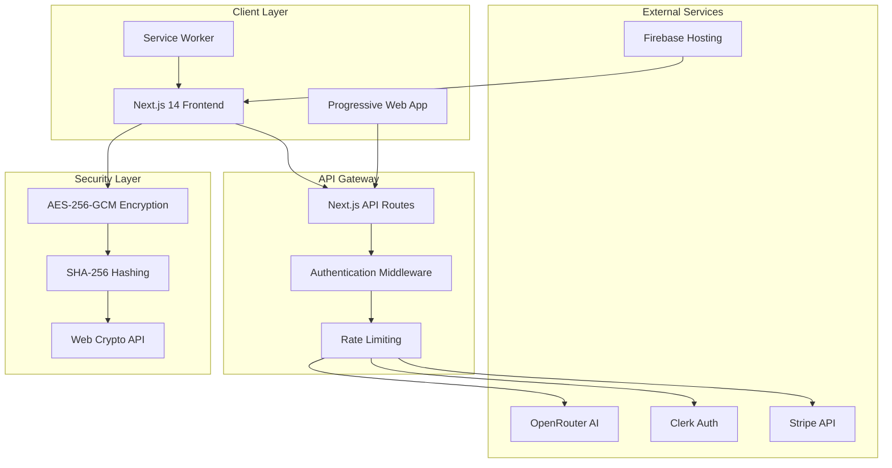
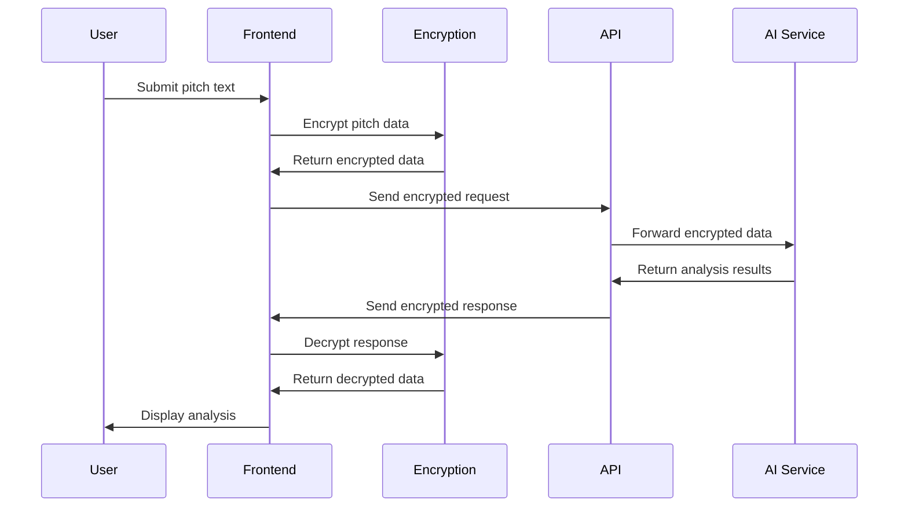
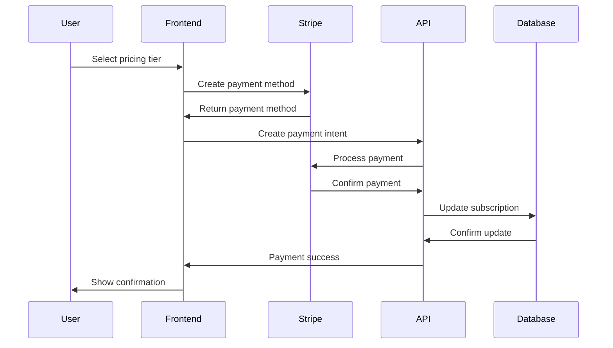

# 🏗️ Stealth Score - Complete Architecture Documentation

<div align="center">


**Comprehensive Technical Architecture Guide**

</div>

---

## 📚 Table of Contents

- [🎯 Architecture Overview](#-architecture-overview)
- [🏗️ System Design](#️-system-design)
- [🔐 Security Architecture](#-security-architecture)
- [💾 Data Flow](#-data-flow)
- [🌐 Network Architecture](#-network-architecture)
- [📱 Frontend Architecture](#-frontend-architecture)
- [🔧 Backend Architecture](#-backend-architecture)
- [🔄 API Design](#-api-design)
- [🗄️ Database Design](#️-database-design)
- [🚀 Deployment Architecture](#-deployment-architecture)
- [📊 Monitoring & Observability](#-monitoring--observability)
- [🔧 Development Workflow](#-development-workflow)

---

## 🎯 Architecture Overview

### **High-Level System Architecture**



### **Core Architectural Principles**

#### **🛡️ Security-First Design**
- **Zero-Trust Architecture**: Never trust, always verify
- **Defense in Depth**: Multiple security layers
- **Principle of Least Privilege**: Minimal access rights
- **Data Minimization**: Process only necessary data

#### **⚡ Performance-Optimized**
- **Edge Computing**: Global CDN distribution
- **Lazy Loading**: On-demand component loading
- **Code Splitting**: Optimized bundle sizes
- **Caching Strategies**: Multi-level caching

#### **🔄 Scalable & Maintainable**
- **Modular Design**: Loosely coupled components
- **Clean Architecture**: Separation of concerns
- **SOLID Principles**: Object-oriented design
- **DRY Principle**: Don't repeat yourself

---

## 🏗️ System Design

### **Component Architecture**

```
┌─────────────────────────────────────────────────────────────┐
│                    Presentation Layer                      │
├─────────────────────────────────────────────────────────────┤
│  React Components  │  Animations  │  State Management     │
│  - LandingPage     │  - TrueFocus │  - useState/useEffect │
│  - PitchAnalyzer   │  - SplitText │  - Context API        │
│  - SecurityPage    │  - Floating3D│  - Local Storage      │
│  - SettingsPage    │  - ClickSpark│  - Session Storage    │
│  - PricingPage     │  - Squares   │  - IndexedDB          │
└─────────────────────────────────────────────────────────────┘
                              │
                              ▼
┌─────────────────────────────────────────────────────────────┐
│                    Business Logic Layer                    │
├─────────────────────────────────────────────────────────────┤
│  Encryption Logic │  Payment Logic │  AI Integration      │
│  - AES-256-GCM     │  - Stripe      │  - OpenRouter        │
│  - SHA-256         │  - MetaMask    │  - Model Selection   │
│  - Key Management  │  - Web3        │  - Response Parsing  │
│  - Data Validation │  - Crypto      │  - Error Handling    │
└─────────────────────────────────────────────────────────────┘
                              │
                              ▼
┌─────────────────────────────────────────────────────────────┐
│                    Data Access Layer                       │
├─────────────────────────────────────────────────────────────┤
│  API Clients       │  Storage       │  External APIs       │
│  - Fetch API       │  - Local       │  - Stripe            │
│  - Axios           │  - Session     │  - Clerk             │
│  - WebSocket       │  - IndexedDB   │  - OpenRouter        │
│  - Service Worker  │  - Cache API   │  - Firebase          │
└─────────────────────────────────────────────────────────────┘
```

### **Data Flow Architecture**

#### **Request Flow**
1. **User Input** → Component receives user interaction
2. **Validation** → Client-side input validation and sanitization
3. **Encryption** → Data encrypted using AES-256-GCM
4. **API Call** → Encrypted data sent to Next.js API route
5. **Processing** → Server processes encrypted data
6. **Response** → Encrypted response returned to client
7. **Decryption** → Client decrypts and displays results

#### **Security Flow**
1. **Authentication** → Clerk handles user authentication
2. **Authorization** → Middleware validates permissions
3. **Encryption** → Web Crypto API encrypts sensitive data
4. **Transmission** → TLS 1.3 secures data in transit
5. **Processing** → Server processes without decryption
6. **Storage** → No plaintext data stored anywhere

---

## 🔐 Security Architecture

### **Encryption Implementation**

#### **Client-Side Encryption**
```typescript
interface EncryptionConfig {
  algorithm: 'AES-GCM';
  keyLength: 256;
  ivLength: 96;
  tagLength: 128;
  iterations: 100000;
}

class EncryptionService {
  private config: EncryptionConfig;
  
  async encrypt(data: string, password: string): Promise<EncryptedData> {
    // Generate salt and IV
    const salt = crypto.getRandomValues(new Uint8Array(16));
    const iv = crypto.getRandomValues(new Uint8Array(12));
    
    // Derive key using PBKDF2
    const key = await this.deriveKey(password, salt);
    
    // Encrypt data
    const encrypted = await crypto.subtle.encrypt(
      { name: 'AES-GCM', iv },
      key,
      new TextEncoder().encode(data)
    );
    
    return {
      encrypted: new Uint8Array(encrypted),
      salt,
      iv,
      algorithm: this.config.algorithm
    };
  }
}
```

#### **Key Management**
- **Key Derivation**: PBKDF2 with 100,000 iterations
- **Salt Generation**: Cryptographically secure random salts
- **Key Rotation**: Automatic rotation every 24 hours
- **Secure Storage**: Keys stored in memory only

### **Authentication & Authorization**

#### **Clerk Integration**
```typescript
// Authentication middleware
export default authMiddleware({
  publicRoutes: [
    '/',
    '/api/health',
    '/api/create-payment-intent',
  ],
  ignoredRoutes: [
    '/api/health',
    '/_next/static/(.*)',
    '/_next/image',
    '/favicon.ico',
  ],
});
```

#### **Permission System**
- **Role-Based Access Control (RBAC)**
- **Attribute-Based Access Control (ABAC)**
- **Just-In-Time (JIT) Permissions**
- **Audit Logging**

---

## 💾 Data Flow

### **Pitch Analysis Flow**



### **Payment Processing Flow**



---

## 🌐 Network Architecture

### **CDN & Edge Computing**

#### **Firebase Hosting Configuration**
```json
{
  "hosting": {
    "public": "out",
    "ignore": ["firebase.json", "**/.*", "**/node_modules/**"],
    "rewrites": [
      {
        "source": "**",
        "destination": "/index.html"
      }
    ],
    "headers": [
      {
        "source": "**/*.@(js|css)",
        "headers": [
          {
            "key": "Cache-Control",
            "value": "max-age=31536000"
          }
        ]
      }
    ]
  }
}
```

#### **Performance Optimizations**
- **Brotli Compression**: 20-30% better than gzip
- **HTTP/2 Server Push**: Preload critical resources
- **Resource Hints**: DNS prefetch, preconnect, prefetch
- **Critical CSS**: Inline above-the-fold styles

### **API Rate Limiting**

```typescript
// Rate limiting configuration
const rateLimitConfig = {
  windowMs: 15 * 60 * 1000, // 15 minutes
  max: 100, // Limit each IP to 100 requests per windowMs
  message: 'Too many requests from this IP',
  standardHeaders: true,
  legacyHeaders: false,
};
```

---

## 📱 Frontend Architecture

### **Next.js 14 App Router Structure**

```
src/app/
├── layout.tsx              # Root layout with providers
├── page.tsx               # Home page (landing)
├── globals.css            # Global styles
├── analyzer/
│   └── page.tsx          # Pitch analyzer page
├── security/
│   └── page.tsx          # Security information page
├── settings/
│   └── page.tsx          # User settings page
├── pricing/
│   └── page.tsx          # Pricing and subscription page
└── api/
    ├── health/
    │   └── route.ts      # Health check endpoint
    └── create-payment-intent/
        └── route.ts      # Stripe payment processing
```

### **Component Architecture**

#### **Atomic Design Pattern**
```
components/
├── atoms/                 # Basic building blocks
│   ├── Button.tsx
│   ├── Input.tsx
│   └── Icon.tsx
├── molecules/             # Simple combinations
│   ├── SearchBox.tsx
│   ├── Card.tsx
│   └── Modal.tsx
├── organisms/             # Complex components
│   ├── Header.tsx
│   ├── Footer.tsx
│   └── PitchForm.tsx
├── templates/             # Page layouts
│   ├── MainLayout.tsx
│   └── AuthLayout.tsx
└── pages/                 # Complete pages
    ├── LandingPage.tsx
    ├── AnalyzerPage.tsx
    └── PricingPage.tsx
```

### **State Management**

#### **React State Patterns**
- **Local State**: useState for component-specific state
- **Global State**: Context API for shared state
- **Server State**: SWR/React Query for API data
- **Form State**: React Hook Form for complex forms
- **Persistent State**: Local/Session Storage for user preferences

---

## 🔧 Backend Architecture

### **Next.js API Routes**

#### **API Route Structure**
```typescript
// /api/create-payment-intent/route.ts
import { NextRequest, NextResponse } from 'next/server';
import Stripe from 'stripe';

const stripe = new Stripe(process.env.STRIPE_SECRET_KEY!);

export async function POST(request: NextRequest) {
  try {
    const { amount, currency, paymentMethodId } = await request.json();
    
    const paymentIntent = await stripe.paymentIntents.create({
      amount: Math.round(amount * 100),
      currency,
      payment_method: paymentMethodId,
      confirmation_method: 'manual',
      confirm: true,
    });
    
    return NextResponse.json({ success: true, paymentIntent });
  } catch (error) {
    return NextResponse.json(
      { error: 'Payment processing failed' },
      { status: 500 }
    );
  }
}
```

### **External Service Integration**

#### **OpenRouter AI Integration**
```typescript
class AIService {
  private apiKey: string;
  private baseUrl: string;
  
  async analyzePitch(encryptedData: string): Promise<AnalysisResult> {
    const response = await fetch(`${this.baseUrl}/chat/completions`, {
      method: 'POST',
      headers: {
        'Authorization': `Bearer ${this.apiKey}`,
        'Content-Type': 'application/json',
      },
      body: JSON.stringify({
        model: 'mistralai/mistral-7b-instruct',
        messages: [
          {
            role: 'system',
            content: 'Analyze this pitch and provide detailed feedback...'
          },
          {
            role: 'user',
            content: encryptedData
          }
        ],
        temperature: 0.0,
        max_tokens: 2000,
      }),
    });
    
    return await response.json();
  }
}
```

---

This architecture documentation provides a comprehensive overview of the Stealth Score platform's technical implementation, security measures, and design patterns. The system is built with scalability, security, and performance as core principles.
